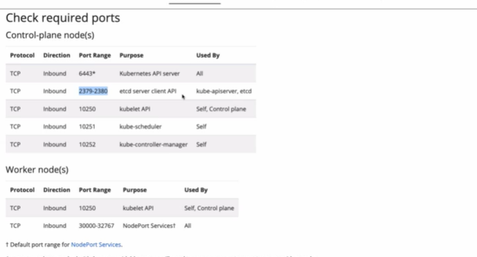
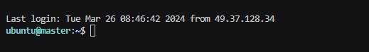

Provision Infrastructure

move private key to .ssh folder and restrict access

Move file from Download to SSH folder

mv ~/Downloads/<pem_file_name> ~/.ssh

Full Permissions

chmod 400 ~/.ssh/<pem_file_name>

ssh into ec2 instance with its public ip

ssh -i ~/.ssh/<pem_file_name> ubuntu@<PublicIP>

(OR)

ssh -i ~/<pem_file_name> ubuntu@PublicIP Address

below one is sample one 

ssh -i ~/Master-Node.pem ubuntu@13.239.25.172 - Use This one from VS-CODE

# Then Install Kubeadmin on Master node from below documentation and make sure pre-requisites ar setuped 

https://kubernetes.io/docs/setup/production-environment/tools/kubeadm/install-kubeadm/

# disable swap inorder for the kubelet to wok properly by using below command

sudo swapoff -a  execute this in all nodes eith in worker node or master node

# Open Ports

By fefault Only 22 port is opened for linux machines but all the other components are running on those server 
but on different ports are not accessible from other instance.

Master and Worker nodes should communicate each other with all the components.

With out opening kubernetes default ports we won't able to join the worker node into master node.

Add the ports in Network Security Group , 

 Ports list

# Master Node Configuration

1) For Kube Api Server -  6443 All the clients inside or outside of the cluster can able to connect

  ip range - 0.0.0.0/0 Sourec is AnyWhere - By executing kubectl commands we have to connect outside of the cluster

2) For etcd server - 2379 -2380 this ports used by kube api server and etcd.

Ip range - 172.31.0.0/16 (soure - custom) from VPC(while creating the vm's it will creates the Ip address, this means any instance which is created in this IP Range those instances will access the etcd server) Nothing but a private network

3) Control Plane and Self - 10250 - Ip range - 172.31.0.0/16 - source - custom

4) Kubeschedular -  10251 - Ip range - 172.31.0.0/16 - source - custom

5) Kube control manager - 10252 - Ip range - 172.31.0.0/16 - source - custom

# Worker Node Configuration

1) Kubelet API - 10250 - Ip Range -            Source -  

2) Node Port Services - 30000 - 32767 - Ip Range - 0.0.0.0/0   Source - Any

# Connect to worker nodes as well 

1) ssh -i ~/<worker-node1>.pem ubuntu@<ip address>

2) ssh -i ~/<worker-node2>.pem ubuntu@<ip address>

3) sudo swapoff -a - swapoff for both nodes

# we have change the hostname as master nodes and worker nodes

Path -  sudo vim /etc/hosts then click on I (Insert) add the private ip address like below for all the nodes like master and worker nodes

<Private IP Address> master
<Private IP Address> Worker-node1
<Private IP Address> Worker-node2

After that, assign a hostname to each of these servers, execute below command in all the servers

for master node - sudo hostnamectl set-hostname <master>

for worker node1 - sudo hostnamectl set-hostname <worker-node1>

for worker node2 - sudo hostnamectl set-hostname <worker-node2>

then exit and login into the cluster it will reflects the server name instead of Private Ip Address

  like this

